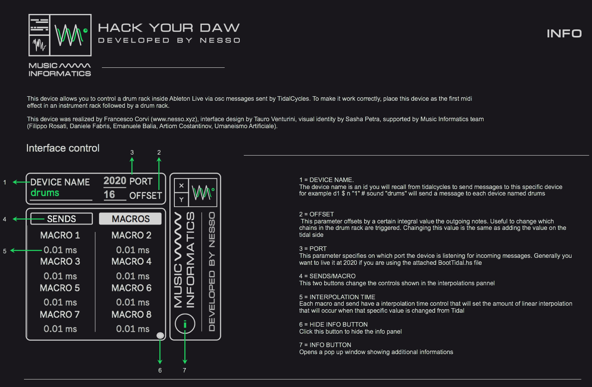

# TidalCycles-Max4Live

                     Francesco Corvi                                 Department of Music Informatics

## Abstract
Here are present a series of Max4live devices that enable controlling Ableton Live through TidalCycles.
Starting from this work, new possible implementation strategies between TidalCycles and Max/MSP and new techniques of algorithmic composition in Ableton Live may be developed.

## Introduction

The TidalCycles language is an expressive and concise way to describe the evolving of patterns in time. This makes it a very effective tool for creating rhythmic structures and managing them over time, particularly for live coding in Algoraves. (more info at www.tidalcycles/userbase).
TidalCycles is typically used in conjunction with the SuperDirt inside Supercollider, but it can be used to control any software or hardware that accepts incoming messages via the Open Sound Control (OSC) protocol. Using TidalCycles to control Max/MSP makes it possible to develop patches/devices that can also be used within Ableton Live and to sequence them in powerful and creative ways.

## Technical overview

TidalCycles sends OSC messages to a target port, this port is specified in the BootTidal.hs file.
By default TidalCycles is meant to be used with the SuperDirt synth inside Supercollider and the standard boot fulfills this purpose. In order to use tidal for controlling Max4Live devices it has to be booted from a folder that contains a different BootTidal.hs which is attached. To make sure tidal has booted with the correct configurations check the path of the boot file in the post window after booting.

As well as being able to create a synthesiser within Max and control it in Ableton Live, this approach can be used to control instruments already available within Live and other Live Session parameters.
This is possible because every time a note message is received an event is played according to the various parameters. The event consists of a midi note and a series of messages that change parameters in Ableton Live using the Live Object Model (LOM).

In the first section of each patch we have an udp receive object that gets messages from the configured OSC port. Then a gate object blocks all messages whose sound parameter does not match the device's sound parameter. In this way, it is possible to send messages on the same port and ensure that each device only considers messages intended for it by specifying a sound parameter in tidal that only matches the target device.

Once received, the message is split into many pairs parameter/value, which are sorted by the route object and then reassembled by a pack object that sends all the information needed to start an instance to a poly~. (the use of poly~ can be avoided if you are only sending midi notes to an internal synth in live, but it can still be useful in some of these cases, for example in the TidalDrumrack controller).

## Conclusion

These devices are based on an integration system between Max/MSP and TidalCycles developed together with Riccardo Ancona. I hope this package can be useful both for programmers who want to lean on a production-ready environment, and for musicians who want to experiment new algorithmic composition strategies with TidalCycles, without having experience with SuperCollider.
